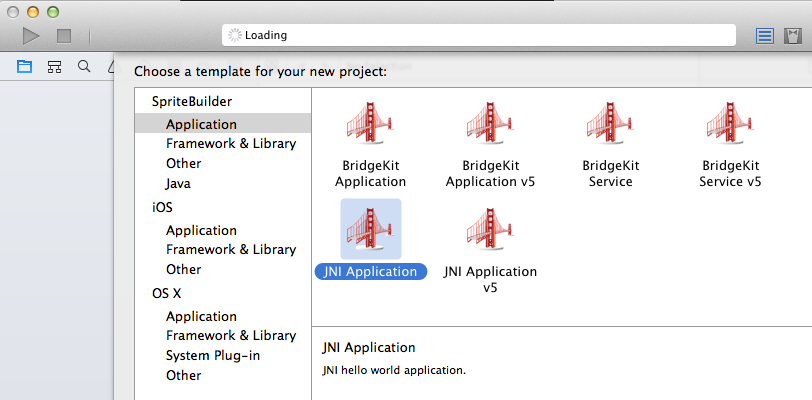
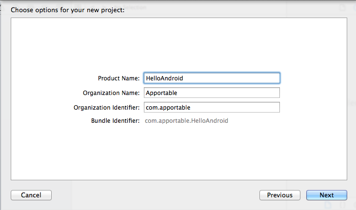
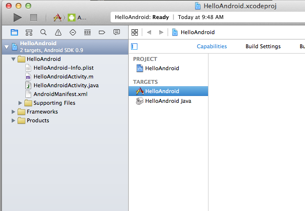
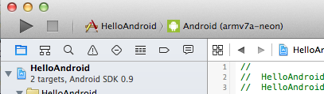
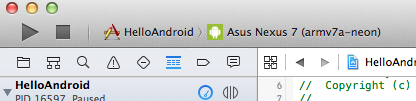
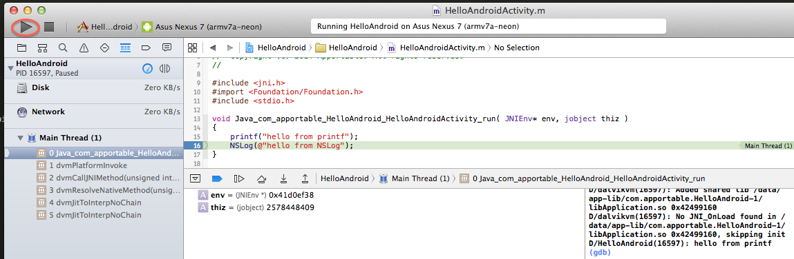
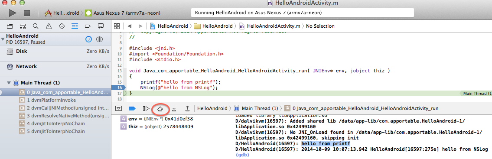

Hello World Tutorial
====================

Hello World shows how to build a minimal JNI hello world program that uses Foundation and builds and runs on an Android device.

Steps
-----

* Start Xcode (Android plug-in must have been installed) 
* Select New->Project
* Choose JNI Application

* Name project
* Choose "com.apportable" for Organization Identifier
	* Optionally choose another identifier
	* If you do, after project creation, edit HelloAndroidActivity.m to match

* Continue to create project

* Connect Android device via USB to Mac
* Make sure the device is in developer mode. 

* If your Mac recognizes the device, the Xcode scheme will transition from a generic Android target

* To showing the specific device

* Open HelloAndroid.m

* Double click line 16 to set a breakpoint

* Click the Build and Run button in the upper left corner

* Note "hello from printf" in the Output log

* Click the Step Over icon

* Note "hello from NSLog" in the Output log

