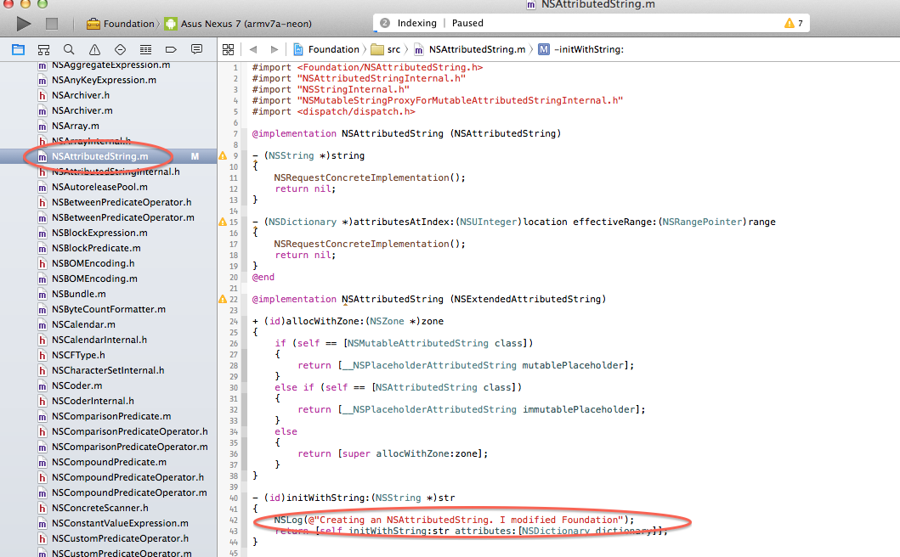
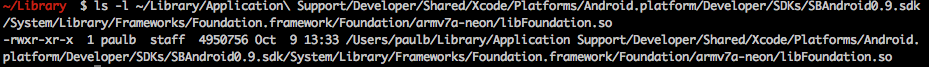
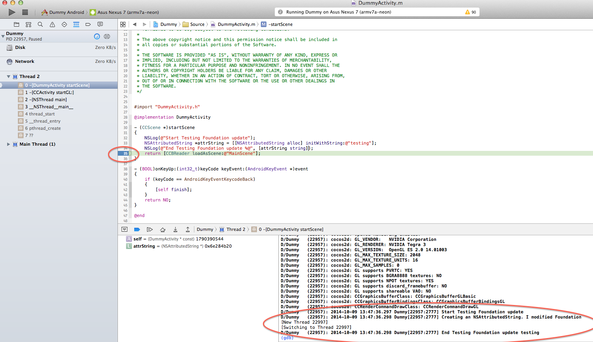

Sprite Builder Tutorial
=======================

The Sprite Builder shows how to modify Foundation and see the results in a SpriteBuilder app.

Requirements:
* Installed version of [SpriteBuilder](http://www.spritebuilder.com/beta)
* Be familiar with connecting to an Android device. See [Hello Tutorial](hello.md)
* Create and Publish a dummy SpriteBuilder app

* Back up installed version of Foundation
	* mkdir ~/backup-Foundation
	* cp -rp ~/"Library/Application Support/Developer/Shared/Xcode/Platforms/Android.platform/Developer/SDKs/SBAndroid0.9.sdk/System/Library/Frameworks/Foundation.framework" ~/backup-Foundation/

* Open NSAttributedString.m and add an NSLog at line 42

* Build Foundation

* Note that the Foundation shared library has an updated timestamp
	* ls -l ~/Library/Application\ Support/Developer/Shared/Xcode/Platforms/Android.platform/Developer/SDKs/SBAndroid0.9.sdk/System/Library/Frameworks/Foundation.framework/Foundation/armv7a-neon/libFoundation.so

* sudo rm -rf  "/Library/SBAndroid/Application Support/Developer/Shared/Xcode/Platforms/Android.platform/Developer/SDKs/SBAndroid0.9.sdk/System/Library/Frameworks/Foundation.framework"
* sudo cp -rp ~/Library/Application\ Support/Developer/Shared/Xcode/Platforms/Android.platform/Developer/SDKs/SBAndroid0.9.sdk/System/Library/Frameworks/Foundation.framework "/Library/SBAndroid/Application Support/Developer/Shared/Xcode/Platforms/Android.platform/Developer/SDKs/SBAndroid0.9.sdk/System/Library/Frameworks"/

* Open ~/Documents/Dummy/Dummy.xcodeproj
* Choose DummyAndroid scheme

* Open DummyActivity.m
* Add code to exercise updated Foundation

* Double click in margin to set breakpoint after new code
* Run and notice output log

