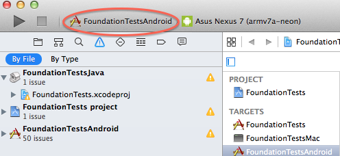
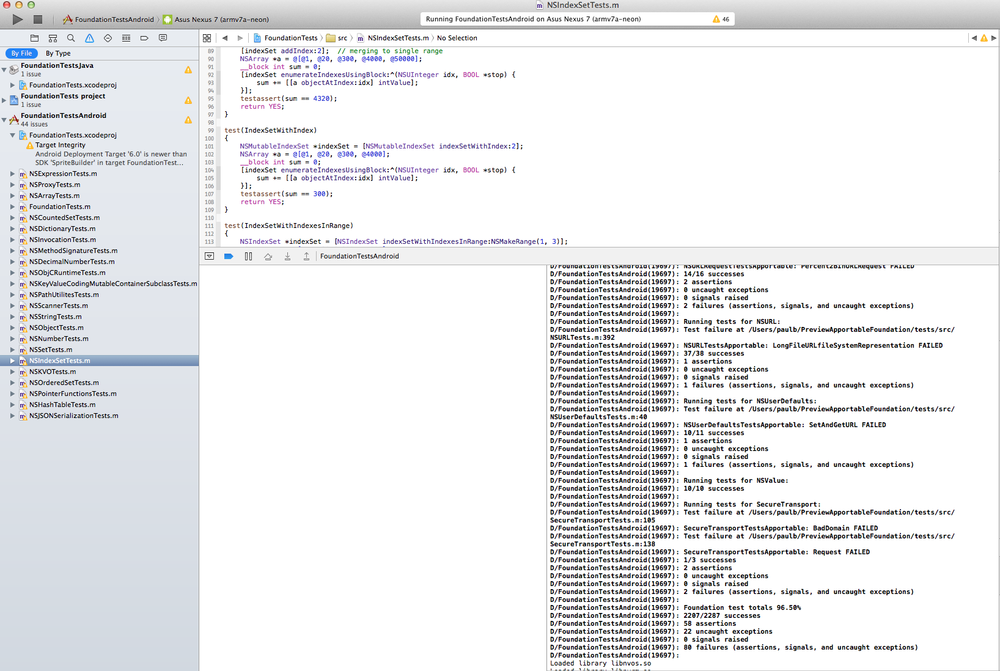

Foundation Tests Tutorial
=========================

Foundation Tests Tutorial describes how to run a set of unit tests for the Foundation framework.

Android
-------

* Be familiar with connecting to an Android device. See [Hello Tutorial](hello.md)
* Open tests/FoundationTests.xcodeproj
* Select FoundationTestsAndroid scheme

* Run

* Note test results in output window

